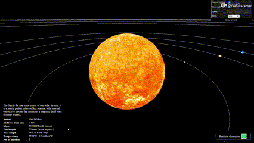

# Realistic 3D Solar System Simulation

Welcome to the 'realistic-3d-solar-system' project! This project provides an interactive 3D simulation of the solar system with options for both realistic and less accurate representations. Users can explore and learn more about each celestial body in the solar system. This is the 2nd version of my old project 'solar-system3D,' which was very inaccurate. This is an updated version with many new features and functions.

Explore Realistic 3D Solar System Simulation [here](https://your-username.github.io/realistic-3d-solar-system).

## Features

- **Realistic Rendering:** Accurate sizes, distances, and rotations of planets and the sun.
- **Interactive Selection:** Click or interact with planets and the sun for detailed information.
- **Camera Focus:** Smooth transitions and dynamic camera movements following the selected path.
- **Educational Content:** Information about each celestial body, including size, composition, orbital details, and interesting facts.
- **User Controls:** Adjust simulation speed, toggle between realistic and less accurate modes, and pause the simulation.
- **Orbital Paths:** Visualize elliptical orbital paths and toggle their visibility.
- **Day/Night Cycle:** Display a day/night cycle on planets with atmospheres.
- **User Preferences:** Customize simulation settings according to user preferences.
- **Responsive Design:** Works seamlessly across various devices and screen sizes.

## Technology Stack

- **Three.js:** The simulation leverages the power of Three.js, a popular JavaScript library for creating 3D graphics in the browser. It enables realistic rendering and smooth animations of the celestial bodies.

- **JavaScript:** The core programming language used to implement the interactive features, user controls, and dynamic simulations. JavaScript ensures a responsive and engaging user experience.

- **HTML5:** The project utilizes HTML5 for structuring the web page and embedding the 3D simulation. HTML5 provides a modern and robust foundation for web development.

- **CSS3:** Styling and layout are enhanced with CSS3, ensuring a visually appealing and responsive design. CSS3 helps create an aesthetically pleasing presentation of the solar system.

- **dat.gui:** User preferences and settings are managed using dat.gui, a lightweight JavaScript library for creating a graphical user interface. It allows users to customize simulation settings easily.
